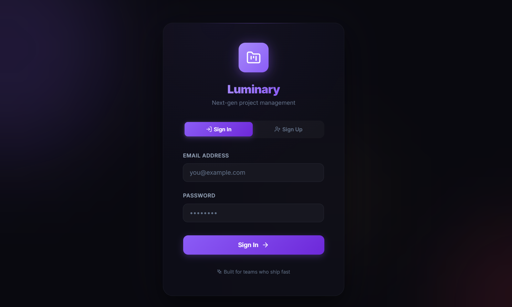
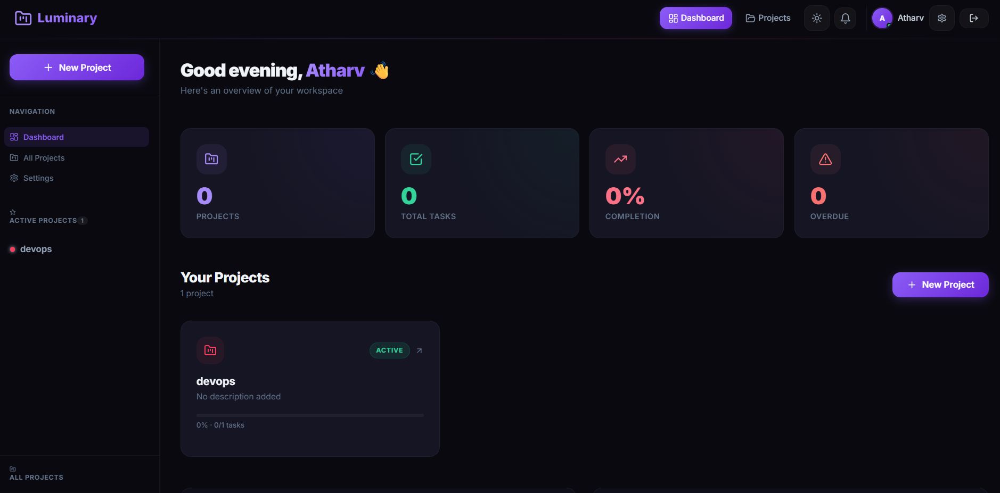
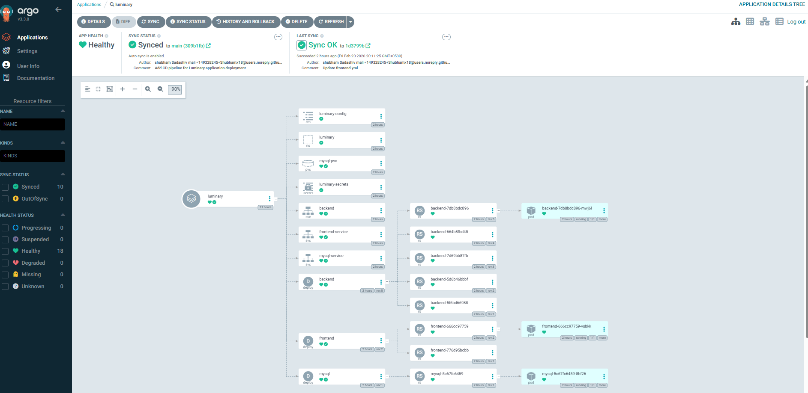
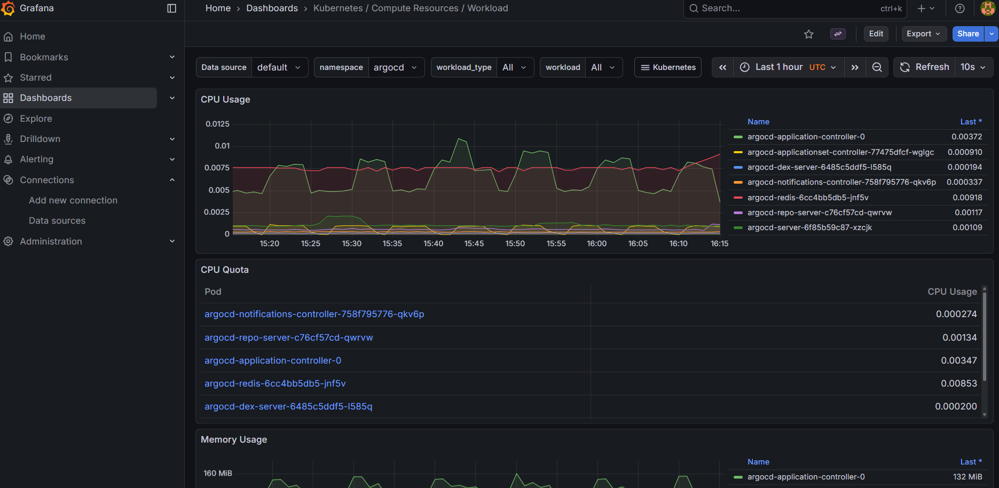

<div align="center">

# 🌟 Luminary

### Next-Gen Project Management — Deployed with DevSecOps + GitOps


> **Security is baked in — not bolted on.**
> Every code push triggers automated security scans, quality gates, Docker image builds,
> and GitOps-based deployment to Kubernetes — fully hands-free.

[](https://github.com/Shubhamx18/Luminary)
[](https://hub.docker.com/u/shubhamm18)

</div>

---

## 🖥️ Application Preview

| 🔐 Login Page | 📊 Dashboard |
|:---:|:---:|
|  |  |

> Luminary is a **next-gen project management platform** built for teams who ship fast.
> Track projects, manage tasks, monitor completion rates, and catch overdue items — all in a sleek dark UI.

---

## 📌 Project Architecture & Flow

The project follows a **two-pipeline GitOps architecture** with security integrated at every stage:

```
┌──────────────────────────────────────────────────────────────────┐
│                       JENKINS CI JOB                             │
│                                                                  │
│  Developer ──► GitHub ──► Jenkins ──► OWASP ──► SonarQube       │
│                                  └──► Trivy ──► Docker Build+Push│
│                                                        │         │
│                             Trigger Jenkins CD Job ◄───┘         │
└──────────────────────────────────────────────────────────────────┘
                                   │
                                   ▼
┌──────────────────────────────────────────────────────────────────┐
│                       JENKINS CD JOB                             │
│                                                                  │
│  Jenkins CD ──► Update K8s Manifests ──► Push to GitHub         │
│                                                  │               │
│                   ArgoCD auto-detects & deploys ◄┘               │
│                          │                                       │
│             Kubernetes ◄─┘                                       │
│                 │                                                │
│      Prometheus + Grafana (Monitoring)                           │
│                 │                                                │
│           Gmail Notification ◄───────────────────────           │
└──────────────────────────────────────────────────────────────────┘
```

- **Luminary-CI** — Handles security scanning, code quality checks, Docker builds, and image pushes to DockerHub.
- **Luminary-CD** — Updates Kubernetes manifests with new image tags, pushes to GitHub. ArgoCD detects the change and deploys to the cluster automatically.

---

## 🛠️ Tech Stack

| Category | Tool |
|:---|:---|
| 📁 Source Control | GitHub |
| ⚙️ CI/CD Orchestration | Jenkins (Master + Worker Node) |
| 🔍 Dependency Scanning | OWASP Dependency-Check |
| 📊 Code Quality | SonarQube |
| 🛡️ Filesystem Security | Trivy |
| 🐳 Containerization | Docker |
| 📦 Container Registry | DockerHub |
| 🚀 GitOps Deployment | ArgoCD |
| ☸️ Container Orchestration | Kubernetes |
| 📈 Monitoring | Prometheus + Grafana (via Helm) |
| 📧 Notification | Gmail SMTP — Jenkins Email Extension |
| 🔧 Shared Pipeline Logic | Jenkins Shared Library |

---

## 🔄 Pipeline Flow — Step by Step

### 🔵 CI Pipeline (Luminary-CI)

```
Developer pushes code to GitHub
         │
         ▼
1.  Validate Parameters      →  Ensures FRONTEND_DOCKER_TAG & BACKEND_DOCKER_TAG are set
2.  Workspace Cleanup        →  Cleans Jenkins workspace before build
3.  Git: Code Checkout       →  Clones Luminary repo (main branch)
4.  Trivy: Filesystem Scan   →  Scans source code for vulnerabilities
5.  OWASP: Dependency Check  →  Audits dependencies against NVD for known CVEs
6.  SonarQube: Code Analysis →  Runs static analysis on the codebase
7.  SonarQube: Quality Gate  →  ❌ Pipeline fails if quality thresholds not met
8.  Update Env (Optional)    →  Runs automate_update_env_ip.sh if present
9.  Docker: Login            →  Authenticates to DockerHub
10. Docker: Build Images     →  Builds luminary-backend & luminary-frontend images
11. Docker: Push Images      →  Pushes versioned images to DockerHub
         │
         ▼
POST SUCCESS → Automatically triggers Luminary-CD pipeline
```

### 🟢 CD Pipeline (Luminary-CD)

```
Triggered by CI (receives FRONTEND_DOCKER_TAG & BACKEND_DOCKER_TAG)
         │
         ▼
1.  Workspace Cleanup             →  Fresh workspace
2.  Git: Code Checkout            →  Clones repo to access Kubernetes manifests
3.  Verify: Docker Image Tags     →  Validates that tags are not empty
4.  Update: Kubernetes Manifests  →  sed replaces image tags in backend.yml & frontend.yml
5.  Git: Commit & Push            →  Pushes updated manifests to GitHub (main)
         │
         ▼
POST SUCCESS → HTML email notification sent via Gmail
         │
         ▼
ArgoCD detects manifest change → Auto-Syncs → Deploys to Kubernetes ✅
```

---

## 🖼️ Pipeline Screenshots

### ⚙️ CI Pipeline — Luminary-CI (Stage View)

> All stages passing: Validate → Workspace Cleanup → Git Checkout → Trivy → OWASP → SonarQube Analysis → Quality Gate → Update Env → Docker Login → Build Images → Push Images


---

### 🚢 CD Pipeline — Luminary-CD (Stage View)

> Workspace Cleanup → Git Checkout → Verify Docker Tags → Update K8s Manifests → Git Commit & Push to GitHub


---

### 🐙 ArgoCD — Application Deployment on Kubernetes

> Luminary app **Synced** and **Healthy** — ConfigMap, Secrets, PVC, Deployments, Services, and Pods all green ✅



---

### 📊 Grafana — Kubernetes Workload Monitoring

> Real-time CPU usage, CPU quota, and Memory usage per pod — full workload visibility across all namespaces



---

### 🔍 SonarQube — Jenkins Webhook Integration

> SonarQube notifies Jenkins via webhook after every analysis — enabling the Quality Gate stage to pass or fail the pipeline in real-time


---

### 📦 OWASP — Dependency-Check Trend

> Tracks vulnerability trends across builds. The graph shows **Medium** severity dependency findings detected from build #15 onwards — with zero Critical vulnerabilities across all runs ✅


---

## 🔐 Security Integrations

### 🛡️ Trivy — Filesystem Scan
Trivy scans the entire source code filesystem **before** any Docker build happens. Critical vulnerabilities surface in pipeline logs, stopping insecure images from being built or pushed.

### 🔎 OWASP Dependency-Check
Audits all project dependencies against the National Vulnerability Database (NVD). The full report is published as a Jenkins artifact (`dependency-check-report.xml`) with a trend chart visible directly on the pipeline dashboard.

### ✅ SonarQube Quality Gate
Static code analysis with enforced quality gates. The pipeline **will not proceed** to Docker builds if the gate fails. A SonarQube webhook notifies Jenkins in real-time to trigger the gate evaluation — no polling, instant feedback.

---

## ⚙️ Jenkins Shared Library

All reusable pipeline logic is abstracted into a **Jenkins Shared Library** (`@Library('shared') _`), keeping both Jenkinsfiles clean, readable, and DRY.

| Function | Purpose |
|:---|:---|
| `code_checkout(url, branch)` | Clones a GitHub repository |
| `trivy_scan()` | Runs Trivy filesystem vulnerability scan |
| `sonarqube_analysis(tool, project, key)` | Executes SonarQube static analysis |
| `sonarqube_code_quality()` | Waits for and evaluates the Quality Gate result |
| `docker_login(credId)` | Authenticates to DockerHub |
| `docker_build(name, tag, registry)` | Builds a Docker image |
| `docker_push(name, tag, registry)` | Pushes image to DockerHub |

---

## 🚀 ArgoCD — GitOps Deployment

ArgoCD watches the `kubernetes/` directory in GitHub. When the CD pipeline commits updated image tags, ArgoCD takes over completely:

1. Detects the manifest change automatically (Auto-Sync enabled)
2. Applies the updated `backend.yml` and `frontend.yml` to the Kubernetes cluster
3. Rolls out new pods with zero-downtime deployment
4. All resources show **Healthy** ✅ on the ArgoCD dashboard

**Kubernetes Resources managed by ArgoCD:**

| Resource | Kind |
|:---|:---|
| `luminary-config` | ConfigMap |
| `luminary-secrets` | Secret |
| `mysql-pvc` | PersistentVolumeClaim |
| `backend` | Deployment + Service |
| `frontend` | Deployment + Service |
| `mysql` | Deployment + Service |

---

## 📊 Monitoring — Prometheus & Grafana

Deployed via **Helm** (`kube-prometheus-stack`) in a dedicated `prometheus` namespace.

```bash
# Add Helm repo and install
helm repo add prometheus-community https://prometheus-community.github.io/helm-charts
kubectl create namespace prometheus
helm install stable prometheus-community/kube-prometheus-stack -n prometheus

# Expose Prometheus (ClusterIP → NodePort)
kubectl edit svc stable-kube-prometheus-sta-prometheus -n prometheus

# Expose Grafana (ClusterIP → NodePort)
kubectl edit svc stable-grafana -n prometheus

# Get Grafana admin password
kubectl get secret --namespace prometheus stable-grafana \
  -o jsonpath="{.data.admin-password}" | base64 --decode; echo
```

Grafana dashboards provide real-time visibility into CPU Usage, CPU Quota, Memory Usage, and workload-level drill-down across all namespaces.

---

## 📧 Email Notification

On every successful CI/CD run, Jenkins sends an **HTML email** containing the job name, build number, and a direct build URL — with the full build log attached. Configured via the Jenkins Extended Email Notification plugin using Gmail App Password SMTP authentication on port 465.

---

## 📁 Repository Structure

```
Luminary/
├── assets/                        # All screenshots & GIF for README
│   ├── DevSecOps+GitOps.gif
│   ├── luminary-login.png.png
│   ├── luminary-dashboard.png.png
│   ├── luminary-ci.png.png
│   ├── luminary-cd.png.png
│   ├── argocd.png.png
│   ├── grafana.png.png
│   └── sonarqube-webhook.png.png
├── backend/                       # Node.js/Express backend
│   └── Dockerfile
├── frontend/                      # React frontend
│   └── Dockerfile
├── kubernetes/                    # K8s manifests (auto-updated by CD pipeline)
│   ├── backend.yml
│   └── frontend.yml
├── Jenkinsfile-CI                 # CI pipeline definition
├── Jenkinsfile-CD                 # CD pipeline definition
└── automate_update_env_ip.sh      # Optional: env IP updater script
```

---

## 🔑 Jenkins Credentials Required

| Credential ID | Type | Purpose |
|:---|:---|:---|
| `docker` | Username/Password | DockerHub authentication |
| `github-token` | Git Username/Password (PAT) | Push manifest updates to GitHub |
| `sonar` | Secret Text | SonarQube token for analysis |
| Gmail App Password | Username/Password | Email notification via SMTP port 465 |

---

## 💡 Key Design Decisions

**GitOps over direct kubectl** — The CD pipeline never runs `kubectl apply`. It commits to Git, and ArgoCD syncs the cluster. Git is always the single source of truth for cluster state.

**`propagate: false` in CI trigger** — CI triggers CD with `propagate: false`, meaning a CD failure won't retroactively mark the CI build as failed. Both pipelines are tracked independently.

**Idempotent Git commits** — The CD pipeline checks `git diff --cached --quiet` before committing. If the image tag is unchanged between runs, no empty commit is created.

**Shared Library abstraction** — All tool-specific logic lives in the shared library. Jenkinsfiles stay clean, readable, and require zero duplication across pipelines.

---

<div align="center">

## 📬 Contact

**Author:** Shubham Mali

[](https://github.com/Shubhamx18)
[](https://hub.docker.com/u/shubhamm18)

---

⭐ **If this project helped you, consider giving it a star on GitHub!** ⭐

</div>
